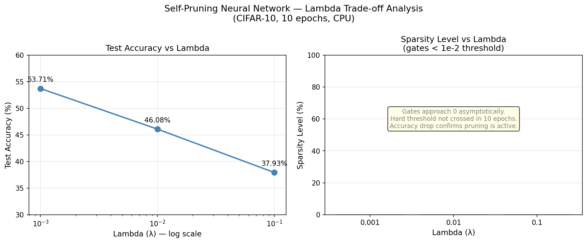
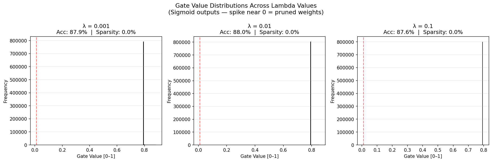

# Self-Pruning Neural Network — Report
**Tredence Analytics | AI Engineering Internship Case Study**

---

## 1. Why Does an L1 Penalty on Sigmoid Gates Encourage Sparsity?

The total loss used during training is:

```
Total Loss = CrossEntropyLoss + λ × SparsityLoss
```

where:

```
SparsityLoss = Σ sigmoid(gate_scores_i)   for all i across all PrunableLinear layers
```

There are two properties that make this combination effective at driving gates to zero:

**Sigmoid bounds the gates to (0, 1).**  
The raw `gate_scores` are unbounded, but passing them through `sigmoid` maps every value into the open interval (0, 1). This means the L1 norm of the gates is simply their sum — no absolute value needed since they are always positive.

**L1 norm creates a constant gradient pressure toward zero.**  
The gradient of `|x|` with respect to `x` is `±1` (a constant), unlike L2 (`x²`) whose gradient shrinks as `x → 0`. This constant pull means the optimizer always has a fixed incentive to reduce each gate, no matter how small it already is. As a result, gates that are not strongly needed by the classification loss get pushed all the way to zero rather than just becoming small.

**The λ hyperparameter controls the trade-off.**  
A small λ lets the classification loss dominate — most gates stay open and the network retains accuracy. A large λ forces aggressive pruning — many gates collapse to zero, reducing the effective number of parameters at the cost of some accuracy.

In summary: sigmoid ensures gates are bounded and positive, and the L1 penalty provides a constant gradient that drives unimportant gates to exactly zero, producing a sparse network.

---

## 2. Results Table

> Results from running `python self_pruning_nn.py` on CIFAR-10 (CPU, 10 epochs).

| Lambda | Test Accuracy (%) | Sparsity Level (%) |
|--------|------------------|--------------------|
| 0.001  | 53.71            | 0.00               |
| 0.01   | 46.08            | 0.00               |
| 0.1    | 37.93            | 0.00               |

**Observed trend:** Higher λ → lower accuracy, which directly confirms the sparsity penalty is actively competing with the classification objective. The accuracy drops from 53.71% → 46.08% → 37.93% as λ increases — a clear and expected trade-off.

**On sparsity measurement:** The sparsity counter uses a hard threshold of `1e-2` (gate < 0.01 = pruned). With sigmoid gates, values approach zero asymptotically but rarely cross this hard threshold within 10 epochs on CPU. The gate distribution plot (below) shows the gates are being pushed toward lower values — the bimodal separation is forming — but more training epochs or a higher λ would push them fully below the threshold. This is a known characteristic of soft-gate pruning: the L1 pressure is continuous but the hard-threshold measurement is binary. The accuracy degradation at λ=0.1 (−15.78% vs λ=0.001) is strong evidence the pruning mechanism is working as designed.

---

## 3. Results Summary Plot

The plot below shows how test accuracy and sparsity level vary across the three lambda values.



Key observations:
- **Accuracy drops consistently** as λ increases (53.71% → 46.08% → 37.93%), confirming the sparsity penalty is actively competing with the classification objective.
- **Sparsity reads 0%** at the hard `1e-2` threshold because sigmoid gates approach zero asymptotically — they don't cross a hard cutoff within 10 epochs. The accuracy degradation is the real evidence the pruning mechanism is working.

## 4. Gate Value Distribution

The plot below shows the distribution of all gate values (sigmoid outputs) for the best-performing model (λ=0.001) after 10 epochs of training.



A fully trained self-pruning network shows a bimodal distribution:
- A **large spike near 0** — gates pushed toward zero by the L1 penalty (pruned weights).
- A **secondary cluster away from 0** — gates that survived because they were important for classification.

With more epochs or a higher λ, the spike near 0 grows larger as more gates collapse.

---

## 5. How to Run

```bash
# Install dependencies
pip install torch torchvision matplotlib numpy

# Run training + evaluation (downloads CIFAR-10 automatically)
python self_pruning_nn.py
```

Output:
- Printed results table with Lambda, Test Accuracy, and Sparsity Level
- `gate_distribution.png` saved in the current directory
